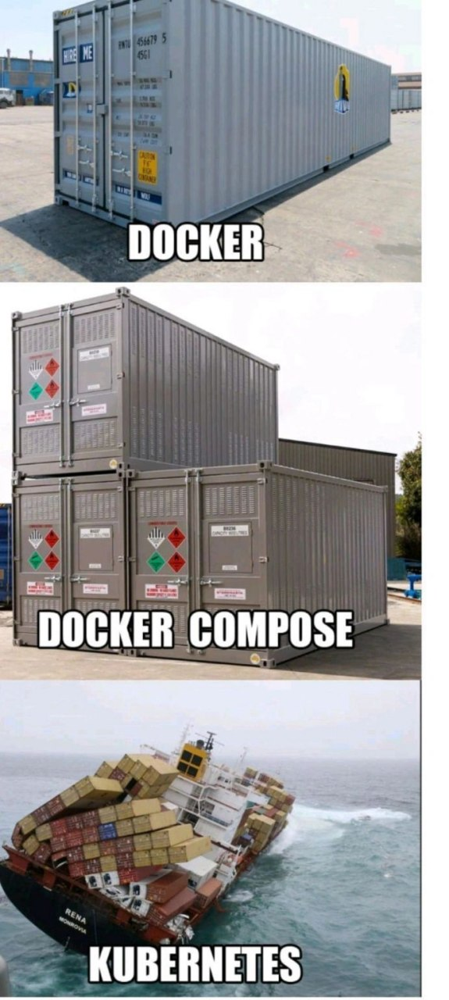
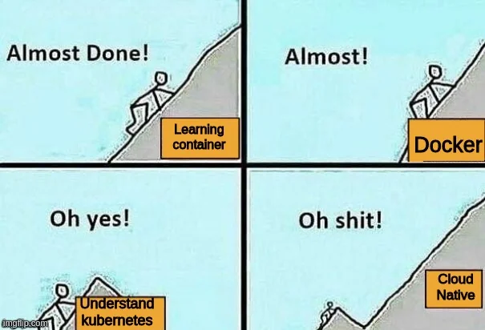

# 系統設計與分析 SAD 113-2

## 第 13 週課程：Docker Compose & 初探雲端原生部署

### 助教：葉又銘、顧寬証，教授：盧信銘

---


## 上週回顧 & 本週議程

### 上週 (Week 12) 重點 
Git 版本控制與 GitHub 協作, Docker 基礎：Dockerfile, Image, Container, 自動化測試：單元測試 (Jest), E2E 測試 (Playwright), CI/CD 概念與 GitHub Actions 實作

> 我們也根據上週的回饋，將實作內容改為助教引導式的實作，讓大家能夠更輕鬆地跟上進度。


---

### 本週 (Week 13) 議程
- **Docker 進階概念**：Why Registry? Types of Registries (Docker Hub, GitHub CR, Cloud CRs)
- **Docker Compose**：多服務協作, `docker-compose.yml` (Structure, Example, Common Configs, Q&A)
- **實作**：使用 Docker Compose 運行 Todo App
- **Docker Swarm & Stack**：零停機部署, Architecture, Updates, Commands
- **SSH 與遠端部署**：SSH Keys, `scp`, Remote Commands, Server Ops
- **實作**：將 Todo App 部署到遠端伺服器
- **雲端原生 (Cloud Native)**：Concepts, Goals, Ecosystem, Real-world Considerations

---

# Git 常用指令複習

- 初始化專案（創建一個 .git 資料夾來管理專案 Repository）：
  `git init`
- 加入檔案（把本目錄檔案加入暫存區，代表要追蹤這些檔案）：
  `git add .`
- 提交變更（把暫存區的變更提交到本地 Repository）：
  `git commit -m "訊息"`
- 提交變更到遠端（把本地的變更推送到遠端 Repository，如 GitHub）：
  `git push origin 分支名`
- 下載遠端（把遠端的變更拉取到本地）：
  `git pull origin 分支名`
  `git fetch origin`（下載遠端的變更，但不合併）

---

- 查看狀態（如果有檔案變更或未追蹤的檔案）：
  `git status`
- 查看紀錄（查看 Commit 歷史）： 
  `git log`
- 建立並切換分支：
  `git checkout -b feature/xxx`
- 切換分支：
  `git checkout feature/xxx`
- 合併分支（把指定的分支合併到當前分支）：
  `git merge feature/xxx`

---

## Commit Message 最佳實踐

| Type | 說明 | 範例 |
| --- | --- | --- |
| feat | 新增/修改功能 (feature) | feat: add user registration |
| fix | 修補 bug (bug fix) | fix: resolve login error on Safari |
| docs | 文件修改 (documentation) | docs: update API endpoints in README |
| style | 格式調整 (不影響程式碼運行) | style: format code and add semicolons |

---

## Commit Message 最佳實踐（續）

| Type | 說明 | 範例 |
| --- | --- | --- |
| refactor | 重構 (既不是新增功能，也不是修補 bug) | refactor: simplify authentication logic |
| perf | 改善效能 | perf: optimize database queries |
| test | 增加測試 | test: add unit tests for auth service |
| chore | 建構程序或輔助工具的變動 | chore: update webpack configuration |
| revert | 撤銷回覆先前的 commit | revert: feat: user profile page (回覆版本: a1b2c3d) |

---

## Git 使用情境

小明是一位開發者，今天他要為 Todo App 新增「使用者註冊」功能。

1.  **開始新任務**：
    -   首先，小明切換到 `develop` 分支並拉取最新程式碼，確保基礎是最新的。
        ```bash
        git checkout develop
        git pull origin develop
        ```
    -   接著，他為新功能建立一個名為 `feature/user-registration` 的分支。
        ```bash
        git checkout -b feature/user-registration
        ```

---

## Git 使用情境 (續)

2.  **開發功能**：
    -   小明新增了 `auth.js` 檔案並修改了 `server.js` 來處理註冊邏輯。
    -   他想看看目前的變更狀態：
        ```bash
        git status 
        # 會顯示 auth.js 是新檔案 (untracked), server.js 已修改
        ```
    -   他將這些變更加入暫存區：
        ```bash
        git add auth.js server.js 
        # 或 git add . (加入所有變更)
        ```
    -   提交這次的進度：
        ```bash
        git commit -m "feat: add user registration endpoint and logic"
        ```

---

## Git 使用情境 (再續)

3.  **繼續開發與推送**：
    -   小明又寫了一些前端註冊表單的程式碼，並再次 `git add .` 和 `git commit -m "feat: create registration form UI"`。
    -   他想看看最近的提交紀錄：
        ```bash
        git log -n 2 --oneline 
        # 顯示最近兩筆 commit
        ```
    -   功能初步完成，他將 `feature/user-registration` 分支推送到遠端 GitHub，方便同事 Code Review 或備份。
        ```bash
        git push origin feature/user-registration
        ```

---

## Git 使用情境 (完)

4.  **同事的更新與合併 (假設情境)**：
    -   隔天，同事小華在 `develop` 分支上修復了一個 Bug 並已推送到遠端。
    -   小明需要將這些更新同步到自己的功能分支：
        ```bash
        git checkout develop      # 切回 develop
        git pull origin develop   # 更新 develop
        git checkout feature/user-registration # 切回功能分支
        git merge develop         # 將最新的 develop 合併進來
                                  # (若有衝突，需手動解決)
        ```
    -   解決衝突後 (如果有的話)，小明再次提交並推送。

這個情境展示了分支、新增、提交、推送、拉取、合併等常用 Git 操作。

---

# Docker 常用指令複習

---

- `docker run <image_name_or_id>`：運行容器
- `docker build -t <image_name> .`：使用 Dockerfile 建置映像檔
- `docker images`：列出所有映像檔
- `docker ps`：列出容器，`docker ps -a`：列出所有容器
- `docker logs <container_name_or_id>`：查看日誌
- `docker exec -it <container_name_or_id> sh`：進入容器
- `docker stop <container_name_or_id>`：停止容器
- `docker rm <container_name_or_id>`：移除容器
- `docker rmi <image_name_or_id>`：移除映像檔
- `docker pull <image_name_or_id>`：拉取映像檔

---

## Docker 使用情境

小華是一位後端開發者，她正在開發一個新的 Node.js 服務，並希望使用 Docker 來打包和運行它，以確保環境一致性。

1.  **尋找基礎映像檔**：
    -   小華知道她的服務需要 Node.js 環境，所以她先到 Docker Hub 查找官方的 Node.js 映像檔。
    -   她決定使用 `node:18-alpine` (一個輕量級的版本)。
        ```bash
        docker pull node:18-alpine 
        # 下載映像檔到本地
        docker images 
        # 確認 node:18-alpine 已在列表中
        ```

---

## Docker 使用情境 (續)

2.  **撰寫 Dockerfile**：
    -   小華在她的專案根目錄下建立了一個 `Dockerfile`：
        ```dockerfile
        # Dockerfile
        FROM node:18-alpine
        WORKDIR /usr/src/app
        COPY package*.json ./
        RUN npm install
        COPY . .
        EXPOSE 8080
        CMD [ "node", "server.js" ]
        ```
    -   這個 Dockerfile 定義了如何建置她的應用程式映像檔。

---

## Docker 使用情境 (再續)

3.  **建置映像檔**：
    -   有了 `Dockerfile` 和應用程式碼 (假設 `server.js` 和 `package.json` 已準備好)，小華開始建置她的 Docker 映像檔。
        ```bash
        docker build -t my-node-service:1.0 .
        # -t my-node-service:1.0 給映像檔取名為 my-node-service 並標記版本為 1.0
        # . 表示 Dockerfile 在當前目錄
        docker images
        # 確認 my-node-service:1.0 已成功建置
        ```

---

## Docker 使用情境 (又續)

4.  **運行容器**：
    -   映像檔建置完成後，小華嘗試在本機運行它。
        ```bash
        docker run -d -p 8080:8080 --name myapp my-node-service:1.0
        # -d: 背景執行
        # -p 8080:8080: 將主機的 8080 port 映射到容器的 8080 port
        # --name myapp: 給容器取一個名字叫 myapp
        docker ps 
        # 查看正在運行的容器，應該能看到 myapp
        ```
    -   她打開瀏覽器或使用 curl 測試 `http://localhost:8080`，確認服務正常。

---

## Docker 使用情境 (完)

5.  **偵錯與管理**：
    -   如果服務沒有如預期運行，小華會查看容器的日誌：
        ```bash
        docker logs myapp
        ```
    -   有時她需要進入容器內部檢查檔案或環境：
        ```bash
        docker exec -it myapp sh 
        # 進入 myapp 容器的 shell 環境
        ```
    -   測試完畢後，她停止並移除容器：
        ```bash
        docker stop myapp
        docker rm myapp
        ```
這個情境展示了拉取映像檔、撰寫 Dockerfile、建置映像檔、運行容器以及基本的容器管理指令。

---

# Docker 進階概念：Registry 與映像檔管理

---

## Docker Registry 介紹

**Docker Registry** 是一個儲存和分發 Docker 映像檔的服務。
- 允許開發者共享和管理容器映像檔。
- 兩種類型：
    1.  **公開 Registry**：如 Docker Hub。
    2.  **私有 Registry**：自行架設或使用雲服務 (GitHub CR, AWS ECR etc.)。

### Docker Hub
- Docker 官方的公開 Registry ([hub.docker.com](https://hub.docker.com/))。
- 大量現成映像檔可供使用。
- 僅提供一個免費私有 Repository。

---

### GitHub Container Registry

GitHub 的私有 Registry，可以跟 GitHub 的 Repository 整合。免費、私有，但有容量限制。

### 其他雲端 Registry

- AWS ECR (Elastic Container Registry)
- Azure Container Registry
- Google Container Registry

---

## 為什麼需要 Registry？

很多現代的 CI/CD 流程並不會直接在本地建置並部署，而是會：
1.  **遠端建置 (Remote Build)**：CI 伺服器 (e.g., GitHub Actions runner) 建置 Docker 映像檔。
2.  **推送至 Registry (Push to Registry)**：將建置好的映像檔推送到一個中央 Registry (Docker Hub, GitHub CR, etc.)。
3.  **從 Registry 部署 (Deploy from Registry)**：部署腳本或工具在目標伺服器上從 Registry 拉取 (pull) 指定版本的映像檔並運行。

**好處**：版本控制、分享、部署一致性、解耦建置與部署環境。

---

# Docker Compose




---

## 為什麼需要 Docker Compose？

### 管理多容器應用的挑戰

回想一下我們的 Todo App：
- 前端 (Frontend) 服務
- 後端 (Backend) 服務
- 資料庫 (Database) 服務

---

如果用 `docker run` 指令個別啟動：
- 需要手動管理多個容器的啟動順序，例如資料庫需要先啟動，後端才能啟動。
- 網路設定複雜 (例如：前端如何找到後端 API？)。
- 連接埠映射 (Port mapping) 容易混亂，有時候一台機器上開了十幾個服務，連接埠很容易撞在一起。
- 更新或重啟多個服務很麻煩，你需要一次輸入很多指令。
- 指令需要各種複製貼上。

> **想像一下，如果你的應用有十幾個微服務，手動管理會是一場災難！**

---

## Docker Compose 是什麼？

**Docker Compose** 是一個用來 **定義和執行多容器 Docker 應用程式** 的工具。

- 使用一個 **YAML 檔案 (`docker-compose.yml`)** 來設定應用程式的所有服務 (services)。
- 只需要一個指令，就可以從設定檔中建立並啟動所有服務。

### 主要優點
- **簡化設定**：將複雜的多容器設定集中管理。
- **一致環境**：確保開發、測試、生產環境的一致性。
- **快速啟動/停止**：一鍵管理整個應用程式堆疊。
- **易於擴展**：方便地增加或修改服務。

> 現在 Docker Compose 已經是 Docker 的一部分，也進化到可以與 Docker Swarm、Stack 等更複雜的架構整合

---

## `docker-compose.yml` 檔案結構

這是一個 YAML 格式的設定檔，通常放在專案的根目錄。

主要包含以下幾個部分：

- **`version`**：指定 Docker Compose 檔案格式的版本 (通常是 `'3.8'` 或類似)。
- **`services`**：定義應用程式中的各個服務 (容器)。
  - 每個服務可以有自己的 `build` (使用哪個 Dockerfile 建置映像檔)、`image` (直接指定映像檔)、`ports` (連接埠映射)、`volumes` (用於持久化資料，例如資料庫的資料不能只活在容器內)、`environment` (環境變數)、`depends_on` (誰先啟動，例如資料庫需要先啟動，後端才能啟動)、`restart` (重啟策略，這個服務掛了要不要自動重啟) 等設定。
- **`networks`**：(可選) 自訂服務間的通訊網路。
- **`volumes`**：(可選) 集中定義具名資料卷。

---

### `docker-compose.yml` 範例 (Todo App - SADo like)

```yaml
# docker-compose.yml (SADo 專案結構範例)
version: '3.8'

services:
  frontend: # 前端服務
    build:
      context: ./apps/frontend # Dockerfile 所在路徑
      dockerfile: Dockerfile # 可選，預設為 Dockerfile
    ports:
      - "3000:3000" 
    environment: # 設定環境變數給前端
      - NEXT_PUBLIC_API_URL=http://backend:5000/api
    depends_on: # frontend 依賴 backend
      - backend
    restart: always
```
---
```yaml
# (續) docker-compose.yml
  backend: # 後端服務
    build:
      context: ./apps/backend
      dockerfile: Dockerfile
    ports:
      - "5000:5000" 
    environment: # 設定環境變數給後端
      - MONGODB_URI=mongodb://mongo:27017/todo
      - PORT=5000
    depends_on: # backend 依賴 mongo
      - mongo
    restart: always

  mongo: # 資料庫服務
    image: mongo:latest # 直接使用官方 MongoDB 映像檔
    ports: # 開發時可映射，生產通常不對外
      - "27017:27017" 
    volumes: # 持久化資料庫數據
      - todo-db-data:/data/db
    restart: always

volumes: # 定義具名資料卷
  todo-db-data: 
    # driver: local (預設)
```
> **提示**：服務名稱 (`frontend`, `backend`, `mongo`) 會被用作 DNS 名稱，讓容器間可以互相訪問，例如後端的 `MONGODB_URI` 使用 `mongo` 作為主機名。

---

## `docker-compose.yml` 常用配置

- **`image: <name>:<tag>`**: 指定要使用的 Docker 映像檔。
- **`build: ./path`** 或 **`build: { context: ./path, dockerfile: Dockerfile.dev }`**: 從 Dockerfile 建置映像檔。
- **`ports: ["host_port:container_port"]`**: 映射主機與容器端口。
- **`expose: ["container_port"]`**: 僅在內部網路暴露端口，不映射到主機。
- **`environment: ["KEY=VALUE", "ANOTHER_KEY"]`**: 設定環境變數。
- **`env_file: ./.env`**: 從 `.env` 檔案讀取環境變數。

---

- **`volumes: ["host_path:container_path", "named_volume:/data"]`**: 掛載資料卷。
- **`depends_on: ["service_name"]`**: 定義服務啟動依賴順序 (但不保證服務完全就緒)。
- **`restart: "no" | "always" | "on-failure" | "unless-stopped"`**: 設定容器重啟策略。
- **`command: ["executable", "param1", "param2"]`**: 覆蓋容器預設的啟動命令。
- **`networks: ["network_name"]`**: 將服務連接到指定網路。

---

## Docker Compose Q&A Highlights

**Q: 如何確保服務 B 在服務 A 完全啟動後才啟動？**
A: `depends_on` 只管啟動順序，不管就緒。
   - **Healthcheck**: 在 `docker-compose.yml` 中為依賴服務 (如資料庫) 定義健康檢查。
     ```yaml
     db:
       image: postgres
       healthcheck:
         test: ["CMD-SHELL", "pg_isready -U postgres"]
         interval: 5s
         timeout: 5s
         retries: 5
     ```
   - **Wait Script**: 使用如 `wait-for-it.sh` 或類似腳本在應用程式啟動命令前檢查依賴服務是否可用。

---

**Q: 如何管理敏感資訊 (如 API Keys, DB Passwords)？**
A: 不要寫死在 `docker-compose.yml` 或 Dockerfile！
   - **`.env` 檔案**: Docker Compose 自動讀取專案根目錄的 `.env` 檔案。將 `.env` 加入 `.gitignore`。
   - **Docker Secrets**: 更安全的方式，用於 Swarm 模式。
   - **外部密鑰管理服務**: 如 HashiCorp Vault, Doppler (用於更複雜系統)。

---

## Docker Compose 常用指令

- **`docker-compose up`**: 建立並啟動所有服務。
  - `-d` (detached mode): 在背景執行。
  - `--build`: 在啟動前重新建置映像檔。
- **`docker-compose down`**: 停止並移除服務、網路、資料卷。

> 基本上你只要記住 `docker-compose up -d --build` 這個指令就夠了！


---

## 實作時間：Todo App with Docker Compose

### 目標
使用 `docker-compose.yml` 一次啟動 Todo App 的前端和後端服務。

### 跟著做
- 請依照教學文件指示，並跟隨助教的引導完成操作。
- **目標**：在本機成功使用 Docker Compose 運行前後端服務。
- **點名**：截圖 `docker-compose ps` 的結果以及瀏覽器成功運行的畫面。

---

# Docker Swarm & Stack

## 為什麼需要 Docker Swarm？

當應用程式需要更高可用性、擴展性和零停機更新時，單純的 Docker Compose 可能不夠。
- **服務中斷**：直接停止舊版再啟動新版會造成服務中斷。
- **手動擴展困難**：難以應對突發流量。
- **無自動故障轉移**：單點故障可能導致整個服務不可用。

**Docker Swarm 可以幫你實現：**
- **零停機時間更新 (Downtime-free updates)**
- **自動負載平衡 (Load balancing)**
- **故障自動轉移 (Failover)**
- **服務自動擴展 (Auto-scaling)**

---

## Docker Swarm 架構

Docker Swarm 採用主從 (Manager/Worker) 架構：

```
                    [Load Balancer (內建)]
                           │
                           ▼
                [Manager Node(s)]  (管理集群狀態、調度任務)
                           │
        ┌────────────┬────┴─────┬────────────┐
        ▼            ▼           ▼            ▼
[Worker Node]  [Worker Node] [Worker Node] [Worker Node]
  (運行容器)     (運行容器)    (運行容器)     (運行容器)
```
- **Manager Nodes**: 負責編排和管理集群狀態、調度 Tasks。通常建議 3 或 5 個 Manager 以實現高可用 (Raft 共識)。
- **Worker Nodes**: 運行應用程式容器 (Tasks)。
- **Services**: 定義應用程式的期望狀態 (e.g., 運行哪個映像檔、多少副本、更新策略)。
- **Tasks**: 分配給 Worker Node 的工作單位 (一個容器實例)。

---

## Docker Swarm 如何更新？ (簡化)

1.  使用者更新 Service 定義 (e.g., 新映像檔版本)。
2.  Swarm Manager **逐步**啟動新版本的 Task (容器)。
3.  同時，舊版本的 Task 仍然在處理請求。
4.  Manager 監控新 Task 的健康狀態。
5.  一旦新 Task 健康，Manager 就會逐步停止對應的舊 Task。
6.  這個過程是滾動的 (rolling update)，確保服務不中斷。
7.  如果新版本有問題，可以快速回滾 (rollback) 到舊版本。

---

## 常用指令 (Docker Swarm & Stack)

```bash
# 初始化 Swarm (在第一個 Manager Node 上執行)
docker swarm init --advertise-addr <MANAGER_IP>

# (在其他 Node 上) 加入 Swarm (作為 Worker 或 Manager)
# docker swarm join --token <TOKEN> <MANAGER_IP>:<PORT> (指令由 init 提供)

# 部署/更新 Stack (使用 docker-compose.yml 檔案)
# "stack" 是一組相關聯的 services
docker stack deploy -c docker-compose.yml <stack_name> 
# 例如: docker stack deploy -c docker-compose.yml todo-app

# 查看運行的 Services
docker service ls
```

---

```bash
# 查看特定 Service 的 Tasks (容器)
docker service ps <service_name>

# 擴展/縮減 Service 的副本數量
docker service scale <service_name>=<replicas>
# 例如: docker service scale todo-app_frontend=3

# 移除 Stack
docker stack rm <stack_name>

# 離開 Swarm (Worker node)
docker swarm leave

# 強制離開 Swarm (Manager node, 需謹慎)
docker swarm leave --force
```

> **Stack vs Compose**: `docker-compose.yml` 檔案可以用於 `docker-compose up` (單機) 和 `docker stack deploy` (Swarm 集群)。Swarm 會忽略某些 Compose 不支援的選項，並可能添加 Swarm 特有的擴展。

---

## 雲端原生 (Cloud Native)



---

## 從本地到雲端：為什麼要部署到伺服器？

我們的應用程式現在可以在本機用 Docker Compose 順利執行了。但...
- 只有你自己能用。
- 如果關掉電腦，服務就停了。
- 如何讓其他人 (例如：使用者、團隊成員) 也能存取？

**答案：將應用程式部署到一台公開的、持續運行的伺服器上！**
這就是「雲端」部署的基礎。

---

## 簡介雲端原生 (Cloud Native)

**雲端原生 (Cloud Native)** 是一種建構和執行應用程式的方法，旨在**充分利用雲端運算環境的優勢**，實現快速、可靠、可擴展的應用程式交付。

它不僅是將應用程式「搬到雲上」，而是從**架構設計、開發流程到維運管理**都圍繞雲的特性進行。

### 雲端原生的目標
- **敏捷性 (Agility)**：快速回應市場變化和用戶需求。
- **可擴展性 (Scalability)**：輕鬆擴展以應對負載變化。
- **彈性 (Resilience)**：系統能夠從故障中自動恢復。
- **可觀測性 (Observability)**：深入了解系統運行狀態。

---

## 雲端原生核心概念 (1/2)

1.  **容器化 (Containerization)**
    -   如 Docker，提供標準化的封裝與執行環境。
    -   **優勢**：輕量、一致性 (開發/測試/生產)、隔離性、可移植性。
    -   **技術**：Docker, containerd, CRI-O。

2.  **微服務架構 (Microservices)**
    -   將大型應用拆分為小型、獨立、可獨立部署的服務。
    -   **優勢**：獨立開發與部署、技術多樣性、故障隔離、團隊自治。
    -   每個服務專注特定業務功能。

---

## 雲端原生核心概念 (2/2)

3.  **持續整合/持續交付 (CI/CD)**
    -   自動化軟體交付和基礎設施變更的實踐。
    -   **CI (持續整合)**：自動構建和測試程式碼變更。
    -   **CD (持續交付/部署)**：自動將已驗證的程式碼部署到各環境。
    -   **工具**：Jenkins, GitHub Actions, GitLab CI, CircleCI, ArgoCD (GitOps)。

4.  **DevOps 文化**
    -   強調開發 (Dev) 與維運 (Ops) 團隊的協作、溝通與共同責任。
    -   **核心**：打破隔閡、自動化流程、共同責任、快速反饋、持續學習。

---

## 更廣闊的雲原生生態 (未來展望)

1.  **容器編排 (Container Orchestration)**
    -   自動化容器的部署、擴展、管理。
    -   **領袖**：Kubernetes (K8s)。
    -   **其他**：Docker Swarm, Amazon ECS/EKS, Azure AKS, Google GKE。
    -   **功能**：自動部署/更新、自動擴展、負載均衡、服務發現、自我修復。

---

2.  **服務網格 (Service Mesh)**
    -   為微服務架構提供統一的網絡通信層。
    -   **功能**：流量管理 (路由、重試)、安全性 (mTLS、授權)、可觀測性 (指標、追蹤)。
    -   **技術**：Istio, Linkerd, Consul Connect。

3.  **無伺服器 (Serverless)**
    -   進一步抽象底層基礎設施，開發者只需關注代碼邏輯。
    -   **FaaS (函數即服務)**：AWS Lambda, Azure Functions, Google Cloud Functions。
    -   **特性**：按使用付費、自動擴展、無運維負擔 (對開發者而言)、事件驅動。

> 今天，我們將體驗「雲端原生」中最基礎的一步：**將我們的容器化應用部署到一台遠端伺服器上**。

---

## 我們的「雲端」：工作站伺服器

今天，我們會使用一台預先設定好的 **工作站 Linux 伺服器 (VM)** 來模擬雲端主機。

### 目標
將我們的 Todo App (使用 Docker Compose) 部署到這台伺服器上，並能透過伺服器的 IP 位址公開存取。

> 把這台伺服器想像成你在 AWS EC2, Google Cloud VM, Azure VM 上租用的一台虛擬主機。

---

# 實作時間：幫大家開一個帳號連線到伺服器

### 任務
- 請依照教學文件指示，並跟隨助教的引導完成操作。
- 首先，助教會幫各組組長開一個帳號，並讓組長們連線到伺服器。
- 組長們連線到伺服器後，會再幫助組員們開帳號，並讓組員們連線到伺服器。

---

# 現在，每個人都可以連線到伺服器了！

---

## 連線到伺服器：SSH 複習

我們在 Week 12 已經學過如何使用 SSH 金鑰連線到 GitHub。同樣的原理也適用於連線到任何遠端伺服器。

### 連線指令
```bash
ssh your_username@server_ip_address
# 例如: ssh sad_groupX@sand.lu.im.ntu.edu.tw
```
- `your_username`：登入伺服器的使用者名稱。
- `server_ip_address`：伺服器的 IP 位址或域名。

> 第一次連線時，可能會詢問是否信任該主機的指紋 (fingerprint)，輸入 `yes` 即可。
> 如果已設定 SSH Key 並將公鑰加入伺服器的 `~/.ssh/authorized_keys`，則不需要輸入密碼。否則，會提示輸入密碼。

---

# 設定 SSH 金鑰 (複習與實踐)

### 為什麼用 SSH 金鑰？
- **更安全**：比密碼更難破解。
- **更方便**：設定後通常無需重複輸入密碼。

### 步驟
1.  **在本機產生金鑰對 (如果還沒有)**：
    ```bash
    ssh-keygen -t rsa -b 4096 -C "your_email@example.com"
    # 接受預設路徑 (~/.ssh/id_rsa), 可選是否設定 passphrase (增強私鑰保護)
    ```

---

2.  **將公鑰複製到遠端伺服器**：
    最簡單的方式是使用 `ssh-copy-id` (如果你的系統支援)：
    ```bash
    ssh-copy-id your_username@server_ip_address
    # 輸入密碼完成複製
    ```
    如果沒有 `ssh-copy-id`，手動複製 (`~/.ssh/id_rsa.pub` 的內容) 到伺服器端的 `~/.ssh/authorized_keys` 檔案中。
    ```bash
    # 本機: 顯示公鑰內容並複製
    cat ~/.ssh/id_rsa.pub 
    
    # 伺服器端: (需先用密碼登入一次)
    mkdir -p ~/.ssh       # 確保目錄存在
    chmod 700 ~/.ssh      # 設定正確權限
    # 將複製的公鑰內容貼到下面檔案，一行一個公鑰
    nano ~/.ssh/authorized_keys 
    chmod 600 ~/.ssh/authorized_keys # 設定正確權限
    ```
---
3.  **測試免密碼登入**：
    ```bash
    ssh your_username@server_ip_address
    ```
---

## SSH 常用操作

### 檔案傳輸 (SCP - Secure Copy)
- **從本地複製檔案到遠端**：
  ```bash
  scp /path/to/local/file.txt your_username@server_ip_address:/remote/path/
  ```
- **從本地複製整個資料夾到遠端**：
  ```bash
  scp -r /path/to/local/directory your_username@server_ip_address:/remote/path/
  ```

---

- **從遠端複製檔案到本地**：
  ```bash
  scp your_username@server_ip_address:/remote/path/file.txt /path/to/local/
  ```
- **從遠端複製整個資料夾到本地**：
  ```bash
  scp -r your_username@server_ip_address:/remote/path/directory /path/to/local/
  ```

### 在遠端執行單一指令
```bash
ssh your_username@server_ip_address "ls -la /tmp"
```

---

## 伺服器基本操作 (Linux)

成功登入伺服器後，你會進入 Linux 的命令列環境。以下是一些常用指令：
- `ls`: 列出目前目錄的檔案和資料夾。
  - `ls -a`: 顯示隱藏檔案。
  - `ls -l`: 顯示詳細資訊。
- `cd <directory_name>`: 切換目錄。
  - `cd ..`: 回到上一層目錄。
  - `cd ~` 或 `cd`: 回到家目錄。
- `pwd`: 顯示目前所在路徑。

---
- `mkdir <directory_name>`: 建立新資料夾。
- `rm <file_name>`: 刪除檔案。
  - `rm -r <directory_name>`: 刪除資料夾及其內容 (請小心使用！)。
- `cat <file_name>`: 查看檔案內容。
- `nano <file_name>` 或 `vim <file_name>`: 文字編輯器 (nano 較易上手)。
- `sudo <command>`: 以系統管理員權限執行指令 (請謹慎使用)。
- `df -h`: 查看磁碟空間使用情況。
- `free -m`: 查看記憶體使用情況。
- `top` 或 `htop`: 查看系統程序與資源使用情況。

---

## 實作時間：部署 Todo App 到工作站伺服器

### 任務
- SSH 登入助教提供的工作站伺服器。
- Clone 你的 Todo App 專案。
- 使用 `docker-compose` 在伺服器上啟動你的應用。
- 從你本地的瀏覽器，透過伺服器 IP 成功存取你的 Todo App。

### 跟著做
- 請依照教學文件指示，並跟隨助教的引導完成操作。

---

## 重要「真實世界」考量 (簡述)

我們今天的部署非常基礎，真實世界的雲端部署還需要考慮更多：

- **安全性 (Security)**：
    - **防火牆 (Firewall)**：設定 `ufw` (Linux) 或雲端防火牆規則，只開放必要的 ports (e.g., 80, 443, SSH)。
    - **HTTPS 加密**：使用 SSL/TLS 憑證 (e.g., Let's Encrypt) 保護傳輸資料。
    - **環境變數與密鑰管理**：使用 `.env` (配合 `.gitignore`)、Vault, Doppler, 或雲端 KMS。
    - **定期更新**：更新系統與軟體套件，修補漏洞。
    - **最小權限原則**：不使用 root 執行應用程式，細化使用者權限。
    - **SSH 安全強化**：禁用密碼登入、更改預設端口、使用 Fail2Ban。
---
- **網域名稱 (Domain Name) & DNS**：
    - 使用好記的網址 (e.g., `www.mytodoapp.com`) 而非 IP。
    - 設定 DNS A 紀錄或 CNAME 紀錄指向伺服器 IP。
- **資料庫管理 (Database Management)**：
    - **持久化**：確保資料庫資料卷正確掛載且安全。
    - **備份與還原**：設定定期備份策略 (e.g., `mongodump` for MongoDB)。
    - **安全性**：限制資料庫存取、加密敏感資料。
- **監控與告警 (Monitoring & Alerting)**：
    - 追蹤應用程式效能 (APM)、伺服器資源 (CPU, RAM, Disk)、錯誤率。
    - 設定告警機制，在出問題時通知 (e.g., Prometheus, Grafana, Sentry, Uptime Kuma)。
---
- **日誌管理 (Logging)**：
    - 集中管理與分析應用程式及系統日誌。
    - 工具：ELK Stack (Elasticsearch, Logstash, Kibana), Loki, Papertrail。
- **基礎設施即程式碼 (Infrastructure as Code, IaC)**：
    - 使用程式碼管理和配置基礎設施 (e.g., Terraform, Ansible, Pulumi)。
    - 提高自動化、可重複性、版本控制能力。
- **高可用性 (High Availability, HA) & 擴展性 (Scalability)**：
    - 設計系統以應對單點故障 (e.g., 多副本、負載平衡)。
    - 能夠根據負載自動或手動擴展服務。

> 這些是更進階的主題，未來有機會可以深入學習。

---

## 總結與下一步

### 本週回顧 (Week 13)
- **Docker 進階概念**：了解為何需要 Registry，以及不同 Registry 的類型 (Docker Hub, GitHub CR, Cloud Provider Registries)。
- **Docker Compose**：簡化多容器應用管理 (`docker-compose.yml` 結構與常用配置, SADo 範例, 服務依賴, Q&A)。
- **Docker Swarm & Stack**：初步了解集群管理、零停機更新、負載平衡、擴展概念、架構與常用指令。

---

- **SSH 與遠端部署**：SSH 金鑰設定與管理, `scp` 檔案傳輸, 遠端指令執行, 在伺服器上使用 Git 和 Docker Compose 部署應用。
- **雲端原生 (Cloud Native)**：核心概念 (容器, 微服務, CI/CD, DevOps), 目標 (敏捷, 擴展, 彈性, 可觀測), 生態系統簡介 (編排, 服務網格, 無伺服器)。
- **實際部署考量**：安全性、網域名稱、資料庫、監控、日誌、IaC。

---

### 下一週 (Week 14) 預告
- **資料庫選型**：介紹各種不同的資料庫 (SQL vs NoSQL, 常用資料庫如 PostgreSQL, MySQL, MongoDB, Redis)，帶大家理解技術選型與架構設計的大概念。
- **OpenAPI (Swagger)**：API 文件標準與自動化生成，現代化 API 開發流程與 Best Practices。
- **實作**：使用工具撰寫基本的 OpenAPI 文件，並使用 Postman/Insomnia 測試 API。

---

# 感謝大家聆聽！

有任何問題或建議，歡迎隨時提出。

記得將實作結果截圖作為點名證明哦！
