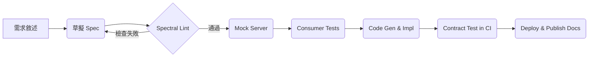

> **閱讀指南**  
> *本檔案即為最終教材*。前半段（章節 1 – 4）為「詳盡講義」，後半段（章節 5）使用
> Marp 語法，可直接 `marp slides.md -o slides.pdf` 產生投影片。  
> 同學可 clone 後分拆成多檔，也可直接匯入大多數 LMS。

---

# 目錄

1. [課程導覽](#課程導覽)  
2. [PART I — 資料庫選型](#parti)  
   2.1 [理論基石：ACID / BASE / CAP / PACELC](#theory)  
   2.2 [資料模型與查詢模式](#models)  
   2.3 [十大主流引擎深度解析](#engines)  
   2.4 [決策矩陣與實戰案例](#matrix)  
   2.5 [雲端 DBaaS 成本與維運](#dbaas)  
   2.6 [資料遷移、CDC 與藍綠](#migration)  
3. [PART II — OpenAPI 3.1 設計與實作](#partii)  
   3.1 [API-first 流程](#api-first)  
   3.2 [規格深入：Components / Callbacks / Links / Webhooks](#spec)  
   3.3 [Versioning、Breaking Change Policy 與治理](#governance)  
   3.4 [安全性：OAuth 2、JWT、mTLS](#security)  
   3.5 [程式碼產生、Mock、合約測試](#tooling)  
   3.6 [CI/CD 與文件自動化](#cicd)  
4. [PART III — 參考架構與實作範例](#reference)  
   4.1 [微服務拓樸](#topology)  
   4.2 [FastAPI x PostgreSQL 範例專案](#fastapi-demo)  
   4.3 [NestJS x MongoDB 範例專案](#nestjs-demo)  
5. [PART IV — Marp 投影片](#slides)  
6. [附錄](#appendices)  

---

## 課程導覽  <a name="課程導覽"></a>

| 項目 | 說明 |
|------|------|
| **對象** | 具備基礎 Web/Backend 經驗之開發者 |
| **時長** | 10 週，每週 2 × 3 hr（講課＋Lab） |
| **核心成果** | *技術選型報告* + *完整 OpenAPI 3.1 規格* + *可執行服務* |
| **評量方式** | <br>1. 小組報告（40 %）<br>2. 期末 Demo（40 %）<br>3. 隨堂小測 / PR Review（20 %） |

---

# PART I — 資料庫選型  <a name="parti"></a>

### 2.1 理論基石 <a name="theory"></a>

| 概念 | 關鍵點 | 影響層面 |
|------|--------|----------|
| **ACID** | 原子性、隔離性、一致性、持久性 | 交易安全、回滾機制 |
| **BASE** | Basically Available, Soft-state, Eventual consistency | NoSQL、大規模分散式 |
| **CAP / PACELC** | Partition ⇄ Consistency / Availability → Delay / Latency / Consistency | 分片、跨區域、佈署策略 |

> **備註：** PACELC 補足了 CAP 未覆蓋的 *延遲 vs 一致性* 取捨。

#### 隔離等級（ANSI SQL）

1. Read Uncommitted  
2. Read Committed  
3. Repeatable Read  
4. Serializable  

> PostgreSQL 9.1+ 的 `Repeatable Read` 相當於 *snapshot isolation*；MySQL InnoDB 於
> `REPEATABLE READ` 下以 *next-key locking* 提供幻影讀防護。

---

### 2.2 資料模型與查詢模式 <a name="models"></a>

| 模型 | 適用場景 | 優點 | 潛在風險 |
|------|----------|------|----------|
| **Relational** | 金流、ERP、報表 | 強一致、複雜 JOIN | 水平擴展成本 |
| **Document** | 內容管理、Event Log | 靈活 schema、水平擴展 | 跨文件 JOIN 困難 |
| **Key-Value** | Session、快取 | 亞毫秒延遲 | 查询/聚合能力弱 |
| **Wide-Column** | IoT、時序 | 壓縮佳、列式聚合 | 二級索引受限 |
| **Graph** | 社交網、推薦 | n-Hop Traversal 高效 | 社群龐大仍稀疏時效能下滑 |
| **Time-Series** | 監控、金融 tick | 壓縮、向下抽樣 | 複雜 JOIN 異常 |

---

### 2.3 十大主流引擎深度解析 <a name="engines"></a>

| Engine | 型別 | 共識 / 複製機制 | 水平擴展 | 可觀測性 |
|--------|------|-----------------|----------|----------|
| PostgreSQL 16 | RDBMS | WAL + Sync / Async Replication | *Citus*、*Cockroach* | pg_stat*, extensions |
| MySQL 8.4 | RDBMS | binlog + Group Replication | Vitess / TiDB | Performance Schema |
| SQLite 3 | RDBMS (Embedded) | N/A | N/A | `EXPLAIN QUERY PLAN` |
| MongoDB 7 | Document | Replica Set + Sharding | Native | Atlas metrics |
| Redis 7 | KV / Stream | Replication + Cluster | Native | MONITOR, SlowLog |
| Cassandra 5 | Wide-Column | Gossip + Quorum | Native | nodetool, JMX |
| DynamoDB | Managed KV / Doc | Multi-AZ Paxos | Auto | CloudWatch |
| Neo4j 6 | Graph | Cluster RAFT | Fabric Sharding | Cypher profile |
| TimescaleDB 2 | Time-Series (PG ext) | Follows PG | Multi-node | Prom + Grafana |
| ClickHouse 24 | Columnar OLAP | ReplicatedMergeTree | Native | system.* tables |

> 節點新增/故障自動化程度：**DynamoDB > Cassandra > MongoDB sharded > PostgreSQL slot**。

---

#### 2.3.1 PostgreSQL JSONB vs MongoDB 原生 Doc

| 工作負載 | Postgres JSONB | Mongo |
|----------|---------------|-------|
| 大量插入 | `COPY` + `UNLOGGED` ≈ 180 K rows/s | Bulk Insert ≈ 150 K docs/s |
| int/float 聚合 | 並行 + `->>` cast，快 ~1.2× | 原生 B-tree | 
| Dynamic schema | 需明確 cast + GIN idx | 天然支援 |

**結論：** 若 90 % 查詢落在結構化欄位，PostgreSQL 仍優；動態欄位數成長快時 Mongo 較彈性。

---

### 2.4 決策矩陣與實戰案例 <a name="matrix"></a>

```text
維度           權重  Postgres  Mongo  Dynamo  Redis
----------------------------------------------------------------
一致性             3      5       3      4      2
水平擴展           2      3       4      5      4
即時查詢           3      4       3      2      5
寫入吞吐           2      3       4      5      4
開發者生態         1      5       4      3      4
運維與成本         1      4       3      2      3
----------------------------------------------------------------
加權總分                4.1     3.6    4.2    3.6
```

> **案例：** *社交動態牆* —— 讀多寫多，需要 tag-based feed 與即時通知。  
> 建議：PostgreSQL（主資料）+ Redis Stream（即時推送）+ OpenSearch（全文）。

---

### 2.5 雲端 DBaaS 成本與維運 <a name="dbaas"></a>

| 服務 | 定價模型 | Free Tier | SLA (Multi-AZ) | 擴縮容 | 잠鎖風險 |
|------|----------|----------|----------------|-------|---------|
| **AWS RDS** (PG/MySQL) | vCPU + I/O + 存儲 | ✅ | 99.95 % | Storage Auto | ✔︎ (ACU) |
| **AWS DynamoDB** | WCU/RCU 或 on-demand | 部分 | 99.999 % (Global) | Auto | ❌ |
| **GCP Cloud SQL** | vCPU + RAM + 存儲 | ✅ | 99.95 % | Storage | ✔︎ |
| **Mongo Atlas** | Instance-Hours | ✅ | 99.995 % (M-30+) | Cluster tier upgrade | ✔︎ |
| **Planetscale (MySQL)** | Connection Minutes | ✅ | 99.95 % | Pod Scale | ⭕ (旋轉鍵) |

---

### 2.6 資料遷移、CDC 與藍綠 <a name="migration"></a>

1. **評估資料分類**  
   * 熱資料（活躍 90 天內）  
   * 歷史資料（Archive / 冷備）  

2. **遷移方法**  
   | 方法 | 停機 | 風險 | 工具 |
   |------|------|------|------|
   | Big-bang | ⬆ | 高 | `pg_dump` / `mongodump` |
   | 影子寫入 (Dual Write) | ↘︎ | 中 | Debezium, Kafka Connect |
   | 流式 CDC + 切換 | ⬇ | 低 | AWS DMS, Striim |

3. **藍綠（或血管）佈署**  
   1. 併行執行兩套服務 → Shadow read（比較一致性）  
   2. Publish percentage (1 %, 10 %, 100 %)  
   3. 一致後 CNAME 切換

---

# PART II — OpenAPI 3.1 設計與實作  <a name="partii"></a>

### 3.1 API-first 流程 <a name="api-first"></a>



---

### 3.2 規格深入 <a name="spec"></a>

#### 3.2.1 Components

```yaml
components:
  schemas:
    UUID:
      type: string
      format: uuid
  responses:
    NotFound:
      description: Resource not found
      content:
        application/json:
          schema:
            $ref: '#/components/schemas/Error'
```

#### 3.2.2 Callbacks / Webhooks

```yaml
paths:
  /payments:
    post:
      callbacks:
        paymentStatus:
          '{$request.body#/callbackUrl}':
            post:
              requestBody:
                $ref: '#/components/requestBodies/PaymentStatus'
```

> *Tip:* 透過 **AsyncAPI 2.7** 將 WebSocket / Kafka 事件與 REST Spec 串接，形成 *event-driven doc*。

---

### 3.3 Versioning 與治理 <a name="governance"></a>

| 策略 | 優點 | 缺點 | 範例 |
|------|------|------|------|
| **URI** (`/v1/`) | 簡單直觀 | 無法同時請求多版本 | GitHub API |
| **Header** (`Accept-Version`) | URL 乾淨 | Cache 難用 | Stripe |
| **Semantic in schema** | *Breaking* 自動偵測 | 工具鏈較新 | Spotify |

*Breaking Change 檢測工具：*  
`openapi-diff`, `swagger-diff`, **Redocly CLI** `lint --ruleset=compatibility`.

Governance 建議：  
* PR Gate：80 % 以上 endpoints 必須有範例與測試。  
* 命名規則：kebab-case path + camelCase JSON keys。  
* 必設 **sunset header** + `Deprecation` header。

---

### 3.4 安全性 <a name="security"></a>

```yaml
securitySchemes:
  OAuth2PKCE:
    type: oauth2
    flows:
      authorizationCode:
        authorizationUrl: https://auth.example.com/authorize
        tokenUrl: https://auth.example.com/token
        scopes:
          articles:read: Read articles
```

* 指標：*最小權限 (Principle of Least Privilege)*。  
* 雙向 TLS (mTLS) 適用於內部微服務呼叫。  
* JWT RS256 建議 15 m 失效 + Refresh Token。

---

### 3.5 程式碼產生、Mock、合約測試 <a name="tooling"></a>

| 工具 | 角色 | 特點 |
|------|------|------|
| **openapi-generator** | 80+ 語言 Server/Client Stub | `-g spring`, `-g go-server` |
| **fastapi-code-generator** | FastAPI 專用 | 自動 Pydantic |
| **Speccy / Spectral** | Lint | 自定規則 |
| **Prism** | Mock / Statefull | 支援 Proxy 模式 |
| **Dredd** | 合約測試 | `dredd api.yaml http://localhost:8000` |

---

### 3.6 CI/CD <a name="cicd"></a>

```yaml
# .github/workflows/api.yml
name: API Pipeline
permissions: read-all
on: [pull_request]
jobs:
  lint-test:
    runs-on: ubuntu-latest
    steps:
      - uses: actions/checkout@v4
      - name: Spectral Lint
        run: npx @stoplight/spectral-cli lint api.yaml
      - name: Contract Test
        run: |
          docker-compose -f docker-compose.test.yml up -d
          npx dredd api.yaml http://localhost:8080
```

* Production 發布後，自動更新 **Redoc** HTML 並 push 至 `docs/`。  
* 可選 *Github Actions + OpenAPI Diff* 於 `main` 分支比對。

---

# PART III — 參考架構與實作範例  <a name="reference"></a>

### 4.1 微服務拓樸 <a name="topology"></a>

```
┌───────────────┐   gRPC   ┌──────────────┐
│  auth-service │─────────▶│ user-service │
└───────────────┘          └──────────────┘
      ▲  ▲                        │        REST
      │  └─────── OAuth2 / JWT ───┘
      │
      │  Webhook
┌───────────────┐◀─────────┐
│ payment-svc    │   Kafka  │
└───────────────┘──────────┘
```

* Internal traffic: mTLS + SPIFFE IDs  
* External REST: `/v1/` + HATEOAS links  
* Each service ships its own `openapi.yaml`; aggregated via *API Gateway*.

---

### 4.2 FastAPI x PostgreSQL 範例 <a name="fastapi-demo"></a>

```bash
openapi-generator-cli generate \
  -i api.yaml -g python-fastapi -o server
cd server
docker compose up --build
```

`docker-compose.yml`

```yaml
services:
  app:
    build: .
    environment:
      DATABASE_URL: postgresql://pg:pg@db:5432/app
  db:
    image: postgres:16
    volumes: [ "pgdata:/var/lib/postgresql/data" ]
volumes:
  pgdata:
```

---

### 4.3 NestJS x MongoDB 範例 <a name="nestjs-demo"></a>

```bash
npx @nestjs/cli new api
cd api
nest add @nestjs/swagger
npm i mongoose @nestjs/mongoose
```

`app.module.ts`

```ts
@Module({
  imports: [
    MongooseModule.forRoot(process.env.MONGO_URI),
    ArticlesModule,
  ],
})
export class AppModule {}
```

`main.ts`

```ts
const config = new DocumentBuilder()
  .setTitle('Articles')
  .setVersion('1.0')
  .addBearerAuth()
  .build();
const doc = SwaggerModule.createDocument(app, config);
SwaggerModule.setup('docs', app, doc);
```

---

# PART IV — Marp 投影片  <a name="slides"></a>

<!-- 下面內容即投影片，marp 會以 `---` 分頁 -->

---
marp: true
theme: default
class: lead
paginate: true
---

# 資料庫選型<br/>OpenAPI 設計實作  
### 10-Week Intensive 🚀

---

## Why *Database Choice* Matters

- Performance ⏱️  
- Consistency ✅  
- Cost 💰  
- Team Skills 👩‍💻

---

## ACID vs BASE

| ACID (RDBMS) | BASE (NoSQL) |
|--------------|-------------|
| Strong TXN   | Eventually consistent |
| Rollback     | Partition tolerant |
| OLTP         | Planet scale |

---

## CAP / PACELC in 60 s

> 在分區失效時只能選擇 **C** 一致性或 **A** 可用性；  
> PACELC 又多考量 **E** 延遲 vs **C** 一致性。

---

## Relational vs NoSQL

| Relational            | NoSQL               |
|-----------------------|---------------------|
| Rigid schema          | Flexible            |
| JOIN, FK              | Denormalise         |
| Vertical scaling easy | Horizontal native   |

---

## Cloud DBaaS Cheat-Sheet

| Service | Free Tier | Auto Scale | Multi-AZ |
|---------|-----------|------------|----------|
| RDS     | ✔︎        | Storage    | ✔︎       |
| Dynamo  | ✔︎        | RCUs / WCUs| ✔︎✔︎✔︎    |
| Atlas   | ✔︎        | Cluster    | ✔︎✔︎     |

---

## API-First Pipeline

1. Draft Spec  
2. Lint & Review  
3. Mock Server  
4. Consumer Tests  
5. Code Gen  
6. CI Contract Test  
7. 🚢 Deploy

---

## OpenAPI Anatomy

```yaml
openapi: 3.1.0
paths:
  /articles/{id}:
    get:
      responses:
        '200':
          $ref: '#/components/...'
```

---

## Security Quick-Start

- OAuth2 PKCE  
- JWT (RS256)  
- mTLS for internal calls  

---

## Code Generation Demo

```bash
openapi-generator-cli generate \
  -i api.yaml -g go-server -o server
```

---

## Mock & Contract Test

```bash
prism mock api.yaml
dredd api.yaml http://localhost:8000
```

---

## Governance Rules

- kebab-case paths  
- camelCase JSON  
- Sunset header for deprecated ops  

---

## Capstone

**Build**: Event Planner API  
- Pick DB  
- Design Spec  
- Deploy & Demo  

---

## Q &A

*Thanks!* 🎉

---

# 附錄 <a name="appendices"></a>

## A. Lab 指引範本

| Lab | 交付物 | 評分指標 |
|-----|--------|----------|
| 1   | 選型提案 | 關鍵維度 + 成本分析 |
| 2   | OpenAPI Draft PR | Spectral > 90 分 |
| 3   | 合約測試 | CI 綠燈 |

## B. 參考資料

1. *Designing Data-Intensive Applications*, M. Kleppmann  
2. PostgreSQL 16 文檔 — *Logical Replication*  
3. *OpenAPI 3.1 Specification* (Swagger)  
4. *API Security in Action*, Manning  

---

_End of File_